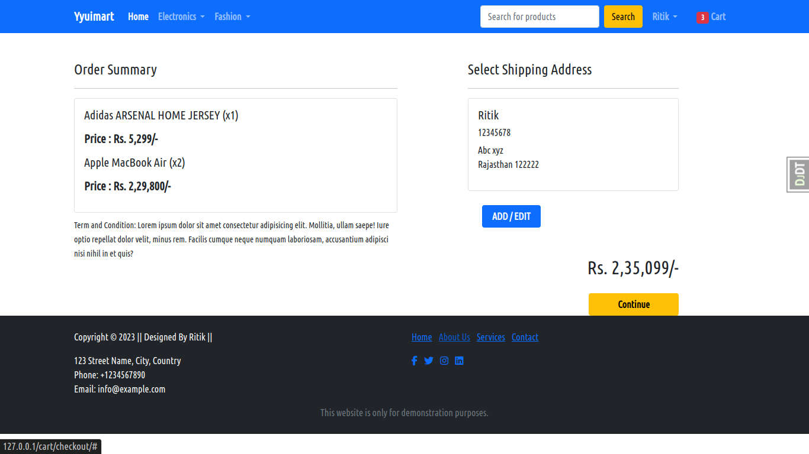

# Yyuimart E-commerce Website 

## Introduction
Welcome to our Django-based E-commerce website project! This repository contains the source code for our online store where users can browse and purchase products, manage their profiles, and perform various account-related actions. Additionally, the project provides API endpoints for seamless integration with external applications.


## Features
- **User Authentication**: Users can create accounts, login, logout, and update their profiles securely. Simple JWT (JSON Web Tokens) is used for authentication, ensuring secure access to user accounts when using API endpoints.
- **OTP Verification**: Users undergo OTP (One-Time Password) verification during account creation and certain sensitive operations for enhanced security.
- **Email Services with Celery**: The website integrates email services using Celery, a distributed task queue, to send OTP verification codes, password change reminders. Celery ensures efficient and asynchronous processing of email tasks, improving system performance.
- **Product Management**: Browse products, view detailed descriptions, and add items to the cart for purchase.
- **Shopping Cart**: Users can add products to their cart, update quantities, and proceed to checkout.
- **Order Management**: Place orders, view order history, and track shipment status.
- **API Endpoints**: Includes endpoints for user profile creation, login, change password, add address, and more, facilitating seamless integration with other applications.
- **Responsive Design**: The website is optimized for various devices, providing a consistent user experience across desktop and mobile platforms.

# Project Setup Instructions

Follow these steps to set up and run the project on your local machine:

### 1. Clone the Repository

```bash
git clone https://github.com/Yyuichiii/Yyuimart---Django-Project.git Yyuimart
```

### 2. Install Dependencies

Install the required dependencies listed in `requirements.txt` using the following command:

```bash
pip install -r requirements.txt
```

### 3. Configure Database Settings

Update the database settings in `settings.py` according to your database configuration.

### 4. Run Database Migrations

Run the database migrations to initialize the database schema:

```bash
python manage.py migrate
```

### 5. Start the Development Server

Start the development server to run the application:

```bash
python manage.py runserver
```

### 6. Start Redis Server (For Linux)

```bash
sudo systemctl start redis-server
```

### 7. Start Celery Worker

Open another terminal and start Celery worker for handling background tasks:

```bash
celery -A Yyuimart worker -l INFO
```

### 8. Running Django Tests

```bash
coverage run --source='.' manage.py test 
coverage report
```
Generate the report in HTML for better visualization
```bash
coverage html
```

Now, your Django project is up and running! Visit `http://localhost:8000` in your web browser to access the application.

Feel free to customize the instructions based on your specific project details and naming conventions.

## API Documentation
The API provides endpoints for the following operations:
- **User Profile Creation**: `POST /api/register/`
- **User Authentication**: `POST /api/login/`
- **User RefreshToken**: `POST /api/refresh/`
- **Change Password**: `POST /api/password_change/`
- **Add/Create/Update Address**: `GET/POST/PUT /api/address/`
- **View/Update Profile**: `GET/PATCH /api/profile/`

## Technologies Used
- Django: Python web framework for building the backend.
- Django Rest Framework: Toolkit for building Web APIs.
- Simple JWT: Secure token-based authentication for API endpoints.
- HTML/CSS: Frontend styling and layout.
- JavaScript: Client-side scripting for dynamic behavior.
- htmx: Library for creating dynamic web pages with minimal JavaScript.
- SQLite: Databases for storing user and product information.
- Email Services: Integration with email services for sending OTP codes, password change reminders, and order summary emails.
- Django Celery And Redis

## Screenshots





## Future Enhancements
- Implement real-time order tracking using WebSockets.
- Integrate additional payment gateways for more payment options.
- Enhance product recommendation engine using machine learning algorithms.
- Implement social login options for user authentication.
- Enhance admin dashboard for better management of products and orders.


## Contributors
- [Ritik Mehra](https://github.com/Yyuichiii)

## Acknowledgments
We would like to thank the Django and Django Rest Framework communities for their excellent documentation and support.
